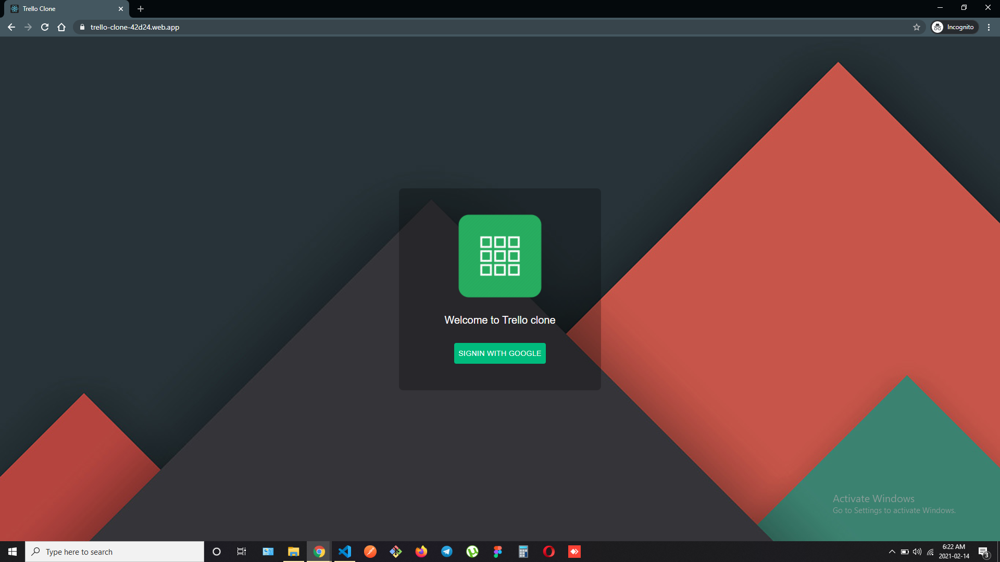
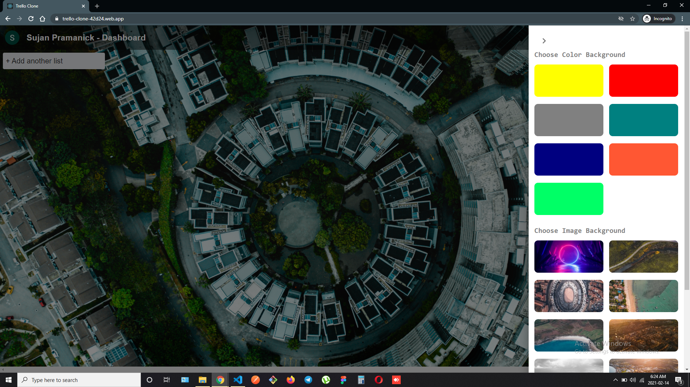
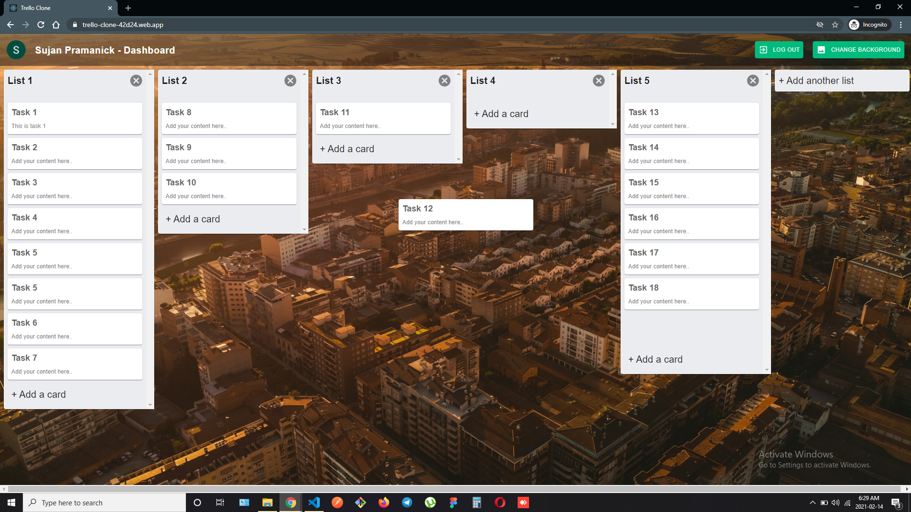
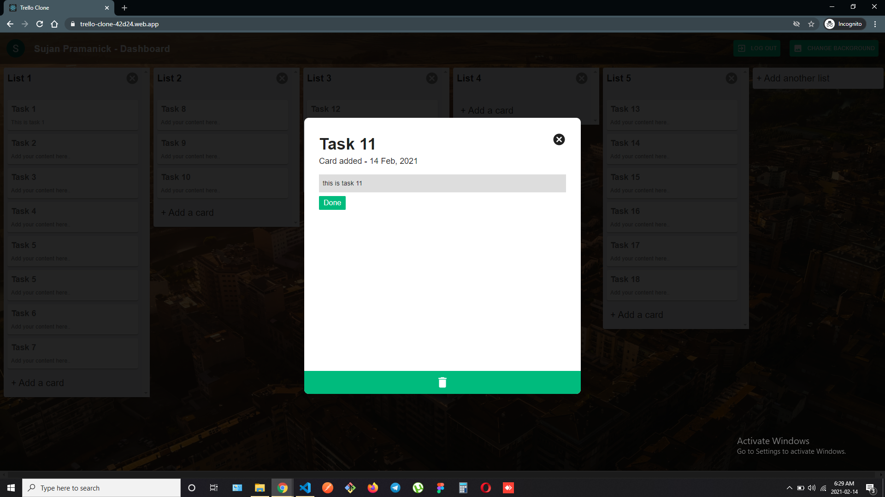
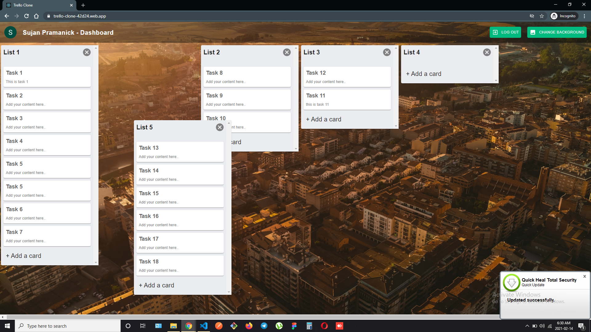

# TRELLO CLONE

Hi! I'm Debjit, a **MERN Stack Developer**. This is a clone of popular project management application **Trello (Listing Tasks)**. I have created it with **React** in frontend,  **Node and Express** for backend and **MongoDB** for storing data. For authentication **Firebase** is used.
 
 
> ### Web App Link - https://trello-clone-42d24.web.app/

 

## Features

- Google Sign-in
- Create lists
- Create cards under particular list
- Update lists and cards
- Reorder lists or cards by dragging them
- Change app background
- Realtime application

##  NPM Packages Used

- React-redux
- Material UI
- Express
- Nodemon
- Mongoose
- React beautiful DnD
- Axios
- Socket IO
- Firebase

## Screenshots

 

 

 

 

 

